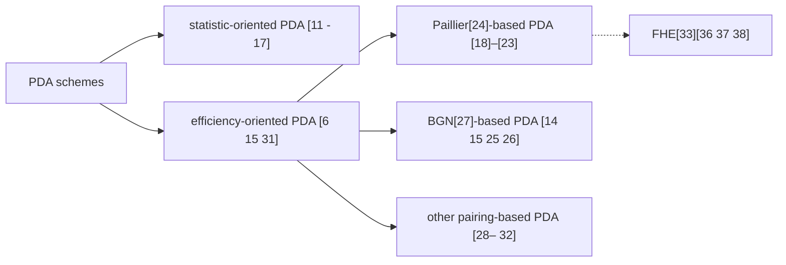
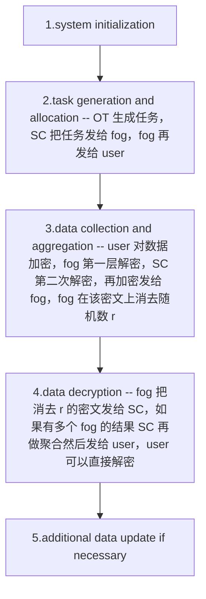

# Syntax

## 普通 markdown 语法

。。。

## Docsify 自带标签

?> 111

!> 222

```
?> 111

!> 222
```


## 自定义 CSS 语法

目前已有的的 CSS 语法如下，使用的 CSS 文件是 @Cody 写的：<https://github.com/baicaihenxiao/js/blob/master/cserclub-common.css>

如果要自己定义 CSS，可以在 `/assets/css/` 下新建 CSS 文件，然后在这里补充使用方式。

### Label

<p class="check" markdown="1">这种方法能在html tag中法</p>

<p class="icon tips" markdown="1">这种方法能在h能方法能在</p>

<p class="icon question" markdown="1">这种方法能方法能在h</p>

<p class="icon notice" markdown="1">这种方法能在法</p>

<p class="icon todo" markdown="1">这种方法能在rkdown语法</p>

<p class="icon label" markdown="1">这种方法能arkdown语法</p>

<p class="icon star" markdown="1">这种方法能rkdown语法</p>


```html
<p class="check" markdown="1">这种方法能在html tag中法</p>

<p class="icon tips" markdown="1">这种方法能在h能方法能在</p>

<p class="icon question" markdown="1">这种方法能方法能在h</p>

<p class="icon notice" markdown="1">这种方法能在法</p>

<p class="icon todo" markdown="1">这种方法能在rkdown语法</p>

<p class="icon label" markdown="1">这种方法能arkdown语法</p>

<p class="icon star" markdown="1">这种方法能rkdown语法</p>

```


### tag

<span class="cser-tag" markdown="1"> LeetCode </span>

```html
<span class="cser-tag" markdown="1"> LeetCode </span>
```


### summary

<details open>
<summary> ccc </summary>

aaa

</details>

```html
<details open>
<summary> ccc </summary>

aaa

</details>
```


可以去掉 `open` 默认折叠。


## mermaid 画图

[Mermaid Examples](https://mermaid-js.github.io/mermaid/#/examples)

[Mermaid Live Editor](https://mermaid-js.github.io/mermaid-live-editor)

### Flowchart 举例

````
​```mermaid
graph LR
    A["PDA schemes"]
    B1["statistic-oriented PDA [11 - 17]"]
    B2["efficiency-oriented PDA [6 15 31]"]
    C1["Paillier[24]-based PDA [18]–[23]"]
    C2["BGN[27]-based PDA [14 15 25 26]"]
    C3["other pairing-based PDA [28– 32]"]
    C4["FHE[33][36 37 38]"]
    A --> B1
    A --> B2
    B2 --> C1
    B2 --> C2
    B2 --> C3
    C1 -.-> C4
    
​```
````





````
​```mermaid
graph TD
    A["1.system initialization"]
    B["2.task generation and allocation -- OT 生成任务，SC 把任务发给 fog，fog 再发给 user"]
    C["3.data collection and aggregation -- user 对数据加密，fog 第一层解密，SC 第二次解密，再加密发给 fog，fog 在该密文上消去随机数 r"]
    D["4.data decryption -- fog 把消去 r 的密文发给 SC，如果有多个 fog 的结果 SC 再做聚合然后发给 user，user 可以直接解密"]
    E["5.additional data update if necessary"]


    A --> B --> C --> D --> E

​```
````





## latex 语法

<https://upupming.site/docsify-katex/docs/#/supported>

