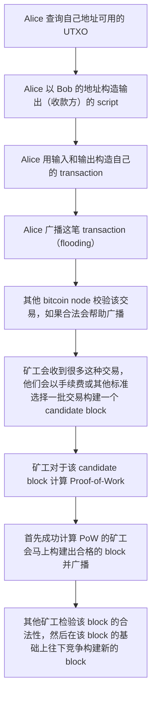

# Mastering Bitcoin 2nd Edition - Programming the Open Blockchain


> Books in GitHub:  <https://github.com/bitcoinbook/bitcoinbook>
>
> Bitcoin in Github: https://github.com/bitcoin
>
> ​ include [bips](https://github.com/bitcoin/bips)


# Glossary

|             |                                                              |
| ----------- | ------------------------------------------------------------ |
| Seed phrase | <https://en.bitcoin.it/wiki/Seed_phrase>  比如 BIP39 BIP32，为了防止私钥丢失，用户可以设置类似密码的词语，如果硬件错误了，可以用这些词语来恢复私钥。 |
| bip         | [Bitcoin Improvement Proposals](https://github.com/bitcoin/bips). A set of proposals that members of the bitcoin community have submitted to improve bitcoin. For example, BIP-21 is a pro‐ posal to improve the bitcoin uniform resource identifier (URI) scheme. |
| Testnet     | <https://en.bitcoin.it/wiki/Testnet> 测试的 blockchain       |
|             |                                                              |
| mempool     | The bitcoin Mempool (memory pool) is a collection of all transaction data in a block that have been verified by bitcoin nodes, but are not yet confirmed. |
|             |                                                              |
| fork        | Fork, also known as accidental fork, occurs when two or more blocks have the same block height, forking the block chain. Typically occurs when two or more miners find blocks at nearly the same time. Can also happen as part of an attack. |
| hard fork   | Hard fork, also known as Hard-Forking Change, is a **permanent divergence** in the blockchain, commonly occurs when non-upgraded nodes can’t validate blocks created by upgraded nodes that follow newer consensus rules. Not to be confused with fork, soft fork, software fork or Git fork.<br>比如 Bitcoin Cash, Bitcoin SV |
| soft fork   | soft fork or Soft-Forking Change is a **temporary fork** in the blockchain which commonly occurs when miners using non-upgraded nodes don’t follow a new consensus rule their nodes don’t know about. Not to be confused with fork, hard fork, software fork or Git fork |

看起来 hard fork 之前的 UTXO 可以在之后同时当 2 种货币用：

[Bitcoin has split in two, so you can have double the cryptocurrency](https://www.theverge.com/2017/8/1/16075276/bitcoin-cash-hard-fork-coinbase)

# CHAPTER 1 Introduction

## bitcoin 的 4 个创新点

four key innovations

> Bitcoin represents the culmination of decades of research in cryptography and distributed systems and includes **four key innovations** brought together in a unique and powerful combination. Bitcoin consists of

1. A **decentralized** peer-to-peer network (the bitcoin **protocol**) 
2. A public transaction **ledger** (the **blockchain**) 
3. A set of **rules** for independent transaction **validation** and currency **issuance** (**consensus** rules)
4. A mechanism for reaching global decentralized consensus on the valid block‐chain (**Proof-of-Work** algorithm)


> **The key innovation** was to use a distributed computation system (called a “**Proof-of-Work**” algorithm) to conduct a **global “election”** every 10 minutes, allowing the decentralized network to arrive at **consensus** about the state of transactions

## digital money 的 3 种问题

Three basic questions for digital money

* 如果要接受一种 digital money，会有这 3 个担心的问题
    1. Can I trust that the money is **authentic** and not counterfeit? 
    2. Can I trust that the digital money can only be spent once (known as the “**double- spend**” problem)?
    3. Can I be sure that no one else can **claim** this money belongs to them and not me?

<p class="icon question" markdown="1"> 不担心钱能不能用？ </p>

* 纸币 (Physical money) 如何处理这 3 个问题？

    1. **伪造问题** - increasingly sophisticated papers and printing technology
    2. **双花问题** - 同一个纸币不可能在 2 个地方出现，而银行转账都是通过中心服务器进行的
    3. **归属问题** - 中心服务器 + 纸币

* 早期的 digital money 存在的问题

    还是需要中心服务器，这些货币是靠国家货币或者黄金来支持兑换的，由于是中心化的，可能会被政府取缔或者黑客攻击，还有母公司倒闭的问题。

    

## Bitcoin 钱包分类

Bitcoin Wallet

<p class="check" markdown="1"> 根据 platform 分类 </p> 

* Desktop wallet

* Mobile wallet

    比如 Mycelium <https://wallet.mycelium.com/>

* Web wallet

    有的像邮件一样把 bitcoin keys 存在第三方服务器里，有的只是在 browser 上运行本地代码存储在本地。

* Hardware wallet

    定制的硬件

* Paper wallet

    Offline storage / cold storage，用纸记下公私钥，当然也可以用其他材料。


<p class="check" markdown="1"> 根据 degree of autonomy and how they interact with the bitcoin network 分类 </p> 

### Full-node client

存储全部节点

目前 2021-06-09 为止全节点 350GB

<https://www.blockchain.com/charts/blocks-size>

> A full-node client consumes substantial computer resources (e.g., more than **125 GB of disk, 2 GB of RAM**) but offers complete autonomy and independent transaction verification.

### Lightweight client

也叫 **simple-payment-verification (SPV**) client，直接和 full node 连接。

> connects to bitcoin full nodes (mentioned previously) for access to the bitcoin transaction information, but stores the user wallet locally and independently cre‐ ates, validates, and transmits transactions

### Third-party API client

不直接和 full node 连接，比如 Web wallet

> interacts with bitcoin through a third-party system of application programming interfaces (APIs), rather than by connecting to the bitcoin network directly

## bitcoin 的内核库 - 不同语言实现

programmatic interfaces into the bitcoin system

> 51 页 第 3 章 最后一节 Alternative Clients, Libraries, and Toolkits，每个库都有链接
>
> There are many alternative clients, libraries, toolkits, and even full-node implementa‐ tions in the bitcoin ecosystem. These are implemented in a variety of programming languages, offering programmers native interfaces in their preferred language.
> The following sections list some of the best libraries, clients, and toolkits, organized by programming languages.


**C/C++**

* Bitcoin Core <https://github.com/bitcoin/bitcoin>
    The reference implementation of bitcoin

* libbitcoin
    Cross-platform C++ development toolkit, node, and consensus library

* bitcoin explorer
    Libbitcoin’s command-line tool

* picocoin
    A C language lightweight client library for bitcoin by Jeff Garzik

    

**JavaScript**

- bcoin
    A modular and scalable full-node implementation with API
- Bitcore
    Full node, API, and library by Bitpay
- BitcoinJS
    A pure JavaScript Bitcoin library for node.js and browsers

**Java**

* bitcoinj <https://bitcoinj.org/#getting-started>
    A Java full-node client library
* Bits of Proof (BOP)
    A Java enterprise-class implementation of bitcoin

**Python**

* python-bitcoinlib
    A Python bitcoin library, consensus library, and node by Peter Todd
* pycoin
    A Python bitcoin library by Richard Kiss
* pybitcointools
    A Python bitcoin library by Vitalik Buterin

**Ruby**

* bitcoin-client
    A Ruby library wrapper for the JSON-RPC API

**Go**

* btcd
    A Go language full-node bitcoin client

**Rust**

* rust-bitcoin
    Rust bitcoin library for serialization, parsing, and API calls

**C#**

* NBitcoin
    Comprehensive bitcoin library for the .NET framework

**Objective-C**

* CoreBitcoin
    Bitcoin toolkit for ObjC and Swift”

## bitcoin 购买注意事项

### 卖 bitcoin

如果有人用国家货币购买 bitcoin，要注意 比特币交易不可逆，但是**银行转账可能退款**，造成损失。

所有有时 seller 会要求身份认证和等时间

> Bitcoin transactions are irreversible. Most electronic payment networks such as credit cards, debit cards, PayPal, and bank account transfers are reversible. For someone selling bitcoin, this difference introduces a very high risk that the buyer will reverse the electronic payment after they have received bitcoin, in effect defrauding the seller
>
> To mitigate this risk, companies accepting traditional electronic payments in return for bitcoin usually require buyers to undergo **identity verification and credit- worthiness checks, which may take several days or weeks**. As a new user, this means you cannot buy bitcoin instantly with a credit card.

### 买 bitcoin

如果买 bitcoin 时做了身份认证，那么 bitcoin address 很容易**被追踪**。

> In order to exchange bitcoin for your national currency, you will often be required to provide proof of identity and banking information. Users should be aware that **once a bitcoin address is attached to an identity, all associated bitcoin transactions are also easy to identify and track**. This is one reason many users choose to maintain dedicated exchange accounts unlinked to their wallets.

列举了几种替代方法：

* bitcoin ATM

    [Coin ATM Radar](https://coinatmradar.com/) 在 ATM 上用纸币兑换 bitcoin

* 从朋友那里买

* 有些公司提供个人转账服务 <https://localbitcoins.com/>

### 查询 bitcoin 价格

市场决定价格

<https://coinmarketcap.com/>

> A **pricing service** will **aggregate the prices from several markets and calculate a volume-weighted averag**e representing the broad market exchange rate of a currency pair (e.g., BTC/USD)

* Bitcoin Average  <http://bitcoinaverage.com/>

    A site that provides a simple view of the volume-weighted-average for each cur‐ rency.

* CoinCap <https://coincap.io/>

    A service listing the market capitalization and exchange rates of hundreds of crypto-currencies, including bitcoin.

* Chicago Mercantile Exchange Bitcoin Reference Rate <http://bit.ly/cmebrr>

    A reference rate that can be used for institutional and contractual reference, pro‐ vided


# CHAPTER 2 How Bitcoin Works

## blockchain explorer

用来查询 bitcoin 的交易细节，可以输入 bitcoin address, transaction hash, block number, or block hash 来查询

> A blockchain explorer is a web application that operates as a **bitcoin search engine**, in that it allows you to search for addresses, transactions, and blocks and see the relationships and flows between them.


* BlockCypher Explorer <https://live.blockcypher.com/> 这个可以查 **Transaction Index** 即 transaction 在 block 里是第几个，下面这个查不了

    URL 支持 `/block/index` 这种类型的查询，比如第 277326 个 block 里的第 64 个交易：<https://live.blockcypher.com/btc/block/277316/64/>

* **blockchain.com** <https://www.blockchain.com/explorer>

* BitPay Insight <https://bitpay.com/insight/#/ALL/mainnet/home>

## 一个 bitcoin 的收款码 + 交易

用 bitcoin wallet (比如 Mycelium) 扫码可以得到：

| 收款地址 | `1GdK9UzpHBzqzX2A9JFP3Di4weBwqgmoQA` |
| -------- | ------------------------------------ |
| 金额     | 0.015BTC                             |
| 地址标签 | Bob's Cafe                           |


用 explorer 可以查看一笔支付 0.015BTC 历史交易

transaction： `0627052b6f28912f2703066a912ea577f2ce4da4caa5a5fbd8a57286c345c2f2`

Alice 付款地址：`1Cdid9KFAaatwczBwBttQcwXYCpvK8h7FK`

<https://www.blockchain.com/btc/tx/0627052b6f28912f2703066a912ea577f2ce4da4caa5a5fbd8a57286c345c2f2>


<p class="icon notice" markdown="1"> 注意大端和小端编码方案的区别 big endian/little endian </p>

网络上传输大部分用的大端方案，但是 bitcoin 里使用的是小端方案，不同的操作系统也不统一，所以在 bitcoin 里要注意这个区别和转换。

比如 <https://blockchain.info/unspent?active=1Cdid9KFAaatwczBwBttQcwXYCpvK8h7FK> 里获取的 json 里会注明 `tx_hash_big_endian` 和 `tx_hash`

```json
    {
      "tx_hash_big_endian": "0627052b6f28912f2703066a912ea577f2ce4da4caa5a5fbd8a57286c345c2f2",
      "tx_hash": "f2c245c38672a5d8fba5a5caa44dcef277a52e916a0603272f91286f2b052706",
      "tx_output_n": 1,
      "script": "76a9147f9b1a7fb68d60c536c2fd8aeaa53a8f3cc025a888ac",
      "value": 8450000,
      "value_hex": "0080efd0",
      "confirmations": 409405,
      "tx_index": 8541318656609876
    }
```


## 单位

1BTC = 100,000,000satoshi

1BTC = 1000millibitcoin

## 交易的输入输出

每个 transaction 有至少一个输入，至少一个输出。

输出的金额相加 <= 输入的金额相加

差额为矿工的手续费

多个输入：<https://www.blockchain.com/btc/tx/199e42904e042298367b5af73a42df4f35389f34f94a4866c9bf994d2bda355c>

多个输出：<https://www.blockchain.com/btc/tx/2a9f010a6c2e510028a45bedd105679b9ef785b4e967553c6270e1ad1cde28c6>


> <https://coinmetrics.io/batching/>
>
> [multiple input and output addresses in bitcoin transactions](https://bitcoin.stackexchange.com/questions/74003/multiple-input-and-output-addresses-in-bitcoin-transactions)
>
> 1. Use as few inputs as possible. In order to minimize inputs, you can periodically send your smaller UTXOs to yourself in times when fees are very low, getting one large UTXO back. That is called **UTXO consolidation** or **consolidating your inputs.**
> 2. Users who frequently make transfers (especially within the same block) can include an almost unlimited amount of outputs (to different people!) in the same transaction. That is called **transaction batching**. A typical single output transaction takes up **230 bytes**, while a two output transaction only takes up **260 bytes**, instead of 460 if you were to send them individually.

由于**手续费**的存在，用户在转账时会尽量**减少交易的字节大小**，而输入比输出占的子节多，因为输入需要地址 + 签名，而输出只需要地址。所以

1. 用户会在手续费少的时候把自己的多个账户的零钱转到一个大账户来，那么在下次转账时只需要一个输入，即减少了以后的手续费。

2. 由于在一个 transaction 使用多个输出的手续费比每个 transaction 里使用一个输出便宜的多，所以频繁交易的用户会将多个交易压缩到一个 transaction 里。

## 常见的交易类型

Common Transaction Forms

### 1 输入 + 2 输出

A 转账给 B，另一个地址为**找零地址**。（为了保护隐私，找零地址和输入的地址不必一样）

找零 - **change**

### 多输入 + 1 输出

> Transactions like these are sometimes generated by wallet applications to clean up lots of smaller amounts that were received as change for payments.

可能是为了把多个找零地址聚合成一个大余额的地址。

### 1 输入 + 多输出

> This type of transaction is sometimes used by commercial entities to distribute funds, such as when processing payroll payments to multiple employees.

可能是为了发工资之类的。


## Story：Alice 用钱交换 Joe 的 bitcoin，并向 Bob 买咖啡

|       | 钱包地址                                                     |
| ----- | ------------------------------------------------------------ |
| Alice | [1Cdid9KFAaatwczBwBttQcwXYCpvK8h7FK](https://www.blockchain.com/btc/address/1Cdid9KFAaatwczBwBttQcwXYCpvK8h7FK) |
| Joe   | [18iWVBbk8tA9bbipS1evviVLP4eE5ga51P](https://www.blockchain.com/btc/address/18iWVBbk8tA9bbipS1evviVLP4eE5ga51P) |
| Bob   | [1GdK9UzpHBzqzX2A9JFP3Di4weBwqgmoQA](https://www.blockchain.com/btc/address/1GdK9UzpHBzqzX2A9JFP3Di4weBwqgmoQA) |


1. Alice 给 Joe  美元，Joe 给 Alice 转账 0.1BTC（该笔交易无手续费）

    交易地址：<https://www.blockchain.com/btc/tx/7957a35fe64f80d234d76d83a2a8f1a0d8149a41d81de548f0a65a8a999f6f18>

    

2. Alice 向 Bob 买咖啡，支付 0.015BTC，找零 0.0845BTC，手续费 0.0005BTC

    交易地址：<https://www.blockchain.com/btc/tx/0627052b6f28912f2703066a912ea577f2ce4da4caa5a5fbd8a57286c345c2f2>

    

针对第 2 笔交易，点开链接可以看到 该交易处在第 [277316](https://www.blockchain.com/btc/block/277316) 个 block 上，但是如何查是该 block 的第几个 transaction？

可以在 [blockcypher.com](https://live.blockcypher.com/btc/block/277316/64/) 上查得知是 64 个 **Transaction Index** = 64。

然后在 [blockchain.com](https://www.blockchain.com/btc/block/0000000000000001b6b9a13b095e96db41c4a928b97ef2d944a9b31b2cc7bdc4?page=13) 上查一下，第 13 页 最后一个(第 5 个) 即为该交易，即处在第 65 个，那是因为第 1 个交易是矿工自己挖矿获利的交易：（由图可知该矿工获得了 25.09094928BTC 的奖励 = 25BTC 新发行的比特币 + 0.09094928BTC 手续费）


## 交易过程

以 Alice 向 Bob 买咖啡为例



一般认为该区块后面跟着 6 个区块则认为该区块不可逆，但是对于小额交易对商户来讲可以马上接受。

# CHAPTER 3 Bitcoin Core: The Reference Implementation

主要实现参考版本是 <https://github.com/bitcoin/bitcoin/releases> ，使用最新的稳定版即可。

<p class="icon tips" markdown="1"> 本书使用的是 0.11.2，本人使用 0.21.1。 </p>


下载下来的是 cpp 源代码，需要自己在本地机器（mac）上编译成可执行程序，如果编译时指定了使用 GUI，则会生成 dmg 可以使用图形界面，否则只能用命令行命令。（自己编译带 GUI 报了 qt 错误，暂时不用 GUI 了，在网上能找到已经编译好的 dmg）


在 <https://www.blockchain.com/charts/blocks-size> 能看到 blockchain size，2021-06-09 时为 350k MB，即全节点大小为 350GB。

## 编译 bitcoind

```
1.
git clone https://github.com/bitcoin/bitcoin.git

2.
git tag
会有 0.21.1 版本对应的 tag： v0.21.1

3.用 tag v0.21.1 新建 2021-06-08-test1 开发分支
git checkout -b 2021-06-08-test1 v0.21.1

4.打开 bitcoin 目录，在 ./docs 目录下能看到很多文档，主要看看 README.md 和 build-osx.md
build-osx.md 里讲了如何在 mac os 下编译代码

5.返回到 bitcoin 目录，根据 build-osx.md 指导运行命令

6.
./autogen.sh
The autogen.sh script creates a set of automatic configuration scripts that will inter‐ rogate your system to discover the correct settings and ensure you have all the neces‐ sary libraries to compile the code. The most important of these is the configure script that offers a number of different options to customize the build process.

7.
./configure
可以加 --help 查看帮助，该命令后面加参数可以 enable or disable certain features of bitcoind。

8.
make
这一步我报错了，忘了是不是这个错误了： <https://stackoverflow.com/questions/31801292/getting-same-error-when-building-bitcoind-on-mac-os-x>

9.
make clean
./configure --without-gui
make
用不带 gui 的编译方式编译成功。（带 gui 应该也能解决，可能是 qt 的原因，实在不行就在网上找编译好的 dmg）

10.
sudo make install
这一步会安装 bitcoind

11.
查看是否安装成功
which bitcoind
which bitcoin-cli

```

## 运行 bitcoind

```
直接命令 bitcoind 可以直接运行下载节点（默认会下载全部节点信息，运行前确认有 350GB 的空间。。。）
书里说没有 bitcoin.conf 不能运行，但是我这个版本可以直接运行，不需要指定该文件

bitcoind 路径 /Users/cody/Library/Application Support/Bitcoin
下载的 block 信息默认也在该路径下
默认读取 conf 位置 /Users/cody/Library/Application Support/Bitcoin/bitcoin.conf

conf 里面的设置和配置示例可以在书上找到


bitcoind -h
bitcoin-cli -h
查看帮助

```


### 查看 RPC 接口

```
bitcoin-cli help
bitcoin-cli -h
获取可调用的 RPC 接口
例如 bitcoin-cli help getblockhash
```

### 查询本地运行状态

```
bitcoin-cli -getinfo
运行 bitcoind 的时候可以时不时地运行这个命令看看状态
monitor the progress and runtime status of your bitcoin node, displays basic information about the status of the bitcoin network node, the wallet, and the blockchain database
```

### 查询交易信息

```
bitcoin-cli getrawtransaction 0627052b6f28912f2703066a912ea577f2ce4da4caa5a5fbd8a57286c345c2f2 true 0000000000000001b6b9a13b095e96db41c4a928b97ef2d944a9b31b2cc7bdc4

getrawtransaction 的使用
bitcoin-cli getrawtransaction 后面跟 3 个参数：
1. transaction 的 hash 
2. true 返回的是 json object 易读，false 返回的是序列化的 string  
3. 该 transaction 所在 block 的 hash
正常思维是只提供第一个参数应该就是能查到该交易，但是这个命令只提供第一个参数默认是在 mempool 里查询。


如果第 2 个参数是false，得到了字符串，可以 bitcoin-cli decoderawtransaction 解码
bitcoin-cli decoderawtransaction 0100000001186f9f998a5aa6f048e51dd8419a14d8a0f1a8a2836dd734d2804fe65fa35779000000008b483045022100884d142d86652a3f47ba4746ec719bbfbd040a570b1deccbb6498c75c4ae24cb02204b9f039ff08df09cbe9f6addac960298cad530a863ea8f53982c09db8f6e381301410484ecc0d46f1918b30928fa0e4ed99f16a0fb4fde0735e7ade8416ab9fe423cc5412336376789d172787ec3457eee41c04f4938de5cc17b4a10fa336a8d752adfffffffff0260e31600000000001976a914ab68025513c3dbd2f7b92a94e0581f5d50f654e788acd0ef8000000000001976a9147f9b1a7fb68d60c536c2fd8aeaa53a8f3cc025a888ac00000000
```

### 查询高度为 1000 的 block 的 hash

```
bitcoin-cli getblockhash 1000
输出 00000000c937983704a73af28acdec37b049d214adbda81d7e2a3dd146f6ed09
```

### 根据 block 的 hash查询 block 的信息

```
bitcoin-cli getblock 00000000c937983704a73af28acdec37b049d214adbda81d7e2a3dd146f6ed09
输出
{
  "hash": "00000000c937983704a73af28acdec37b049d214adbda81d7e2a3dd146f6ed09",
  "confirmations": 337336,
  "strippedsize": 216,
  "size": 216,
  "weight": 864,
  "height": 1000,
  "version": 1,
  "versionHex": "00000001",
  "merkleroot": "fe28050b93faea61fa88c4c630f0e1f0a1c24d0082dd0e10d369e13212128f33",
  "tx": [
    "fe28050b93faea61fa88c4c630f0e1f0a1c24d0082dd0e10d369e13212128f33"
  ],
  "time": 1232346882,
  "mediantime": 1232344831,
  "nonce": 2595206198,
  "bits": "1d00ffff",
  "difficulty": 1,
  "chainwork": "000000000000000000000000000000000000000000000000000003e903e903e9",
  "nTx": 1,
  "previousblockhash": "0000000008e647742775a230787d66fdf92c46a48c896bfbc85cdc8acc67e87d",
  "nextblockhash": "00000000a2887344f8db859e372e7e4bc26b23b9de340f725afbf2edb265b4c6"
}
```

这个交易只有 1 个交易，可以在网上查验：

<https://www.blockchain.com/btc/block/00000000c937983704a73af28acdec37b049d214adbda81d7e2a3dd146f6ed09>

查询前面的例子 Alice 给 Bob 的交易的 block：

```
bitcoin-cli getblock 0000000000000001b6b9a13b095e96db41c4a928b97ef2d944a9b31b2cc7bdc4
```

里面第 65 个即为该 transaction 的 id

```
0627052b6f28912f2703066a912ea577f2ce4da4caa5a5fbd8a57286c345c2f2
```

## 其他程序访问 API

Bitcoind 本质上是提供了一系列 API，用 `bitcoin-cli` 只是一种调用的方式。

> bitcoin-cliBitcoin Core’s API is a JSON-RPC interface 

运行 `bitcoin-cli help getblockhash` 会举例有 2 中方式，一种是命令行，一种是 HTTP/HTTPS

```
Examples:
> bitcoin-cli getblockhash 1000
> curl --user myusername --data-binary '{"jsonrpc": "1.0", "id": "curltest", "method": "getblockhash", "params": [1000]}' -H 'content-type: text/plain;' http://127.0.0.1:8332/
```

还可以用其他程序访问，比如 `python-bitcoinlib`

```
pip3 install python-bitcoinlib
```

# CHAPTER 4 Keys, Addresses

## 和支票类比

| bitcoin         | check                                                     |
| --------------- | --------------------------------------------------------- |
| public key      | bank account number                                       |
| private key     | secret PIN, or signature on a check                       |
| bitcoin address | beneficiary name on a check (i.e., “Pay to the order of”) |

bitcoin address 大多数情况是用 public key 产生的，但也有用 scripts 表示的。

> This way, bitcoin addresses **abstract the recipient of funds, making transaction destinations flexible**, similar to paper checks: a single payment instrument that can be used to pay into people’s accounts, pay into company accounts, pay for bills, or pay to cash


## 私钥 公钥 地址 的关系

private key $k$

public key $K$

bitcoin address $A$

从私钥生成公钥，再从公钥生成地址，都是单向的。

下图只是简介，还有一些细节没体现。


## 使用的椭圆曲线

> <https://en.bitcoin.it/wiki/Secp256k1>
>
> 
>
> 关于 secp256k1 安全性的讨论：
>
> [Google：is secp256k1 secure](https://www.google.com/search?q=is+secp256k1+secure)
>
> [Bitcoin Forum: Bitcoin secp256k1 not safe. Fails four tests.](https://bitcointalk.org/index.php?topic=380482.msg4083612#msg4083612)
>
> [Is secp256r1 more secure than secp256k1?](https://crypto.stackexchange.com/questions/18965/is-secp256r1-more-secure-than-secp256k1)
>
> 

National Institute of Standards and Technology (**NIST**) 定义的标准 **secp256k1**

$$y^2 = (x^3 +7) \ over \ (F_p)$$

或者表示为

$$y^2 \mod p = (x^3 +7) \mod p$$

其中

$$p = 2^{256} – 2^{32} – 2^9 – 2^8 – 2^7 – 2^6 – 2^4 – 1 \approx 2^{256} $$

$$2^{256} = 115792089237316195423570985008687907853269984665640564039457584007913129639936 \approx 1.158 * 10^{77}$$

该椭圆曲线构成循环群的阶为：

$$n = 115792089237316195423570985008687907852837564279074904382605163141518161494337 \approx 1.158 * 10^{77}$$

$n$ 是一个比 $p \approx 2^{256}$ 小一点的数。（[Hasse's theorem on elliptic curves](https://en.wikipedia.org/wiki/Hasse's_theorem_on_elliptic_curves)）

群的生成元 $G$ 为

$G = (x, y)$ `= (79BE667E F9DCBBAC 55A06295 CE870B07 029BFCDB 2DCE28D9 59F2815B 16F81798, 483ADA77 26A3C465 5DA4FBFC 0E1108A8 FD17B448 A6855419 9C47D08F FB10D4B8)`

### 私钥的选择

随机选择一个 256 位的数，如果大于等于 $n$，则重新选，直到满足 $1 <= private key <= n - 1$。

<p class="icon notice" markdown="1"> 不要自己写代码产生 随机数生成器，或者只是简单的使用编程语言提供的随机数生成器。而是应该使用 cryptographically secure pseudorandom number generator (CSPRNG) with a seed from a source of sufficient entropy</p>

### 公钥的生成

公钥 $K = k * G$


### 公钥私钥示例


|          |                                                              |
| -------- | ------------------------------------------------------------ |
| 私钥 Hex | `1e99423a4ed27608a15a2616a2b0e9e52ced330ac530edcc32c8ffc6a526aedd` 或者大写 `1E99423A4ED27608A15A2616A2B0E9E52CED330AC530EDCC32C8FFC6A526AEDD` |
| 公钥 Hex | $K = k * G = (x, y) = $ `(F028892BAD7ED57D2FB57BF33081D5CFCF6F9ED3D3D7F159C2E2FFF579DC341A, 07CF33DA18BD734C600B96A72BBC4749D5141C90EC8AC328AE52DDFE2E505BDB)` |

可以看到公钥的 y 前面有个 0，是因为算出来 y 不足 256 位，在高位补了 0。

## 私钥 => 公钥 => 地址


### 私钥 => 公钥 => 地址 全过程示意图

> <https://en.bitcoin.it/wiki/Invoice_address>


### Base58Check

<p class="icon tips" markdown="1"> 本质上是进制转换，所以用 Base58Check 编码和解码是很容易双向转换的，不存在 hash 之类的单向性。 </p>

* **Base64**

    > <https://en.wikipedia.org/wiki/Base64>

    64 进制编码，26 大写字母 + 26 小写字母 + 10 数字 + 2 字符 (`+ /`)

* **Base58**

    58 进制编码，Base64 去掉 6 个字符： `0((number zero) O(capital o) l(lower L) I(capital i) + /`，也即：

    `123456789ABCDEFGHJKLMNPQRSTUVWXYZabcdefghijkmnopqrstuvwxyz`

* **Base58Check**

    58 进制编码，在 Base58 的基础上加上校验功能。这个过程就是在原码的**前面加 1 个 byte 表示 version，后面加 4 个 byte 表示 checksum，然后对整个进行进制转换。**

    注意这是一种编码方案，**没有压缩，本质上是进制转换**（从 2 进制 / 16 进制 / 10 进制 转换成了 58 进制），所以也可以**很容易从 Base58Check 转换回到原码**。

    

Base58Check 在 私钥 => 公钥 => 地址 整个过程中被多次用到，在不同位置用的 `Version Prefix` 不同。

* 比如内容第一行 `Bitcoin Address 0x00 1` 表示在公钥转地址的过程中使用 Base58Check 时，如果是 main net 则加的前缀的一个字节为 `0x00`。

* 内容第四行 `Private Key WIF` ，表示对私钥进行编码（编码成 WIF 或 WIF-Compressed）时加的前缀为 `0x80=128`，WIF 则生成的前缀为 5，WIF-Compressed 则为 K 或 L。


### 私钥表示

前面说了私钥是一个随机选择的 256bit 的数（最大值比  $2^{256}$  小一点），这里私钥有 3 种表示形式：

* 原码（Raw(byte)/Hex/Decimal/bit）

* WIF

    $WIF = Base58Check(Hex) $ ，5 开头

* WIF-Compressed

    $WIF-Compressed = Base58Check(Hex+0x01) $ ，K 或 L 开头

Hex 一般是程序内部使用的，WIF 和 WIF-Compressed 一般是钱包之间导入导出私钥时使用的（比如扫描二维码）。

WIF 是直接对 Raw 进行 Base58Check 编码的，WIF-Compressed 是 Raw 后面加一个字节 `0x01` 再进行 Base58Check 编码的，所以**这 3 种编码是可以互相转换的**。

下图显示了 **WIF 和 WIF-Compressed 的前缀的特征**（即 Base58Check 编码后前缀的特征）。


用 [公钥私钥示例](#公钥私钥示例) 里面的私钥做示例：

|                |                                                              |
| -------------- | ------------------------------------------------------------ |
| Hex            | `1e99423a4ed27608a15a2616a2b0e9e52ced330ac530edcc32c8ffc6a526aedd` 或者大写 `1E99423A4ED27608A15A2616A2B0E9E52CED330AC530EDCC32C8FFC6A526AEDD` |
| WIF            | `5J3mBbAH58CpQ3Y5RNJpUKPE62SQ5tfcvU2JpbnkeyhfsYB1Jcn`        |
| WIF-Compressed | `KxFC1jmwwCoACiCAWZ3eXa96mBM6tb3TYzGmf6YwgdGWZgawvrtJ`       |

<p class="check" markdown="1"> 从 Base58Check 解码  </p>

* 从 WIF-Compressed 解码回 Hex，可以看到加的后缀 `0x01` 和前面的 version `128 = 0x08`

    

* 从 WIF 解码回 Hex，可以看到前面的 version `128 = 0x08`

    

<p class="check" markdown="1"> 用 Base58Check 编码  </p>

* 从 Hex 转换到 WIF，即直接对 Hex 进行 Base58Check 编码

    

* 从 Hex 转换到 WIF-Compressed，即对 Hex 后面加上 `0x01` 再进行 Base58Check 编码

    


<p class="check" markdown="1"> 可以看出 WIF-Compressed 比 WIF 字节更多，那为什么叫 Compressed  呢？ </p>

是因为这里的压缩不是指对私钥进行压缩，私钥是无法压缩的，这里是指要对从私钥推导出的公钥进行压缩（公钥可以压缩）。

> the private key has an added one-byte suffix (shown as 01 in hex in Table 4-4), which **signifies that the private key is from a newer wallet and should only be used to produce compressed public keys**. Private keys are not themselves compressed and cannot be compressed. The term “compressed private key” really means “**private key from which only compressed public keys should be derived**,” whereas “uncompressed private key” really means “private key from which only uncompressed public keys should be derived.”


<p class="icon notice" markdown="1"> WIF 和 WIF-Compressed 能互相转换，但是不能互相使用</p>

这个听起来本别扭，前面已经说了可以互相转换，但是为什么叫不能互相使用？

是因为**旧版本的 wallet 可能不支持公钥压缩**（compressed public keys），那么旧版本则只能使用 WIF，意味着旧版本里进行的交易（写在区块链上的交易）都是用非压缩方式的公钥和钱包地址，所以导入 WIF 时会产生非压缩的公钥和钱包地址去 blockchain 上搜索。

<p class="icon notice" markdown="1"> 注意不管是 Hex 还是 WIF WIF-Compressed 只是私钥的表示不同，不管是哪种私钥表示，都是用相同的方式来生成公钥。 </p>

即 $Hex * G$，WIF 和 WIF-Compressed 都需要先转成 Hex 格式才能算出公钥。

### 公钥表示

前面说了公钥是椭圆曲线 $$y^2 = (x^3 +7) \ over \ (F_p)$$ 上的一个点 $K = (x, y)$，那么给定 $x$ 可以算出 $y$，但是由于曲线是上下对称的，所以 $\sqrt{y^2}$ 有正负 2 个值。由于曲线是 $\mod p$ 的，所以负数模 p 转成正数和本来的正数必定 1 奇 1 偶。

> [On public keys compression, why an even or odd y coordinate corresponds to the positive / negative sign respectively?](https://bitcoin.stackexchange.com/questions/41662/on-public-keys-compression-why-an-even-or-odd-y-coordinate-corresponds-to-the-p)

所以为了得到准确地 y，需要加一个标志位表明 y 是奇数还是偶数。即**用 `标志位 + x` 来压缩公钥**。

<p class="icon question" markdown="1"> 为什么不存 y，计算 x，这样应该不用标志位了吧？ </p>

如下图：


继续用 [公钥私钥示例](#公钥私钥示例) 里面的公钥做示例：

|                |                                                              |
| -------------- | ------------------------------------------------------------ |
| 私钥 Hex       | `1E99423A4ED27608A15A2616A2B0E9E52CED330AC530EDCC32C8FFC6A526AEDD` |
| 公钥 Hex       | $K = k * G = (x, y) = $ `(F028892BAD7ED57D2FB57BF33081D5CFCF6F9ED3D3D7F159C2E2FFF579DC341A, 07CF33DA18BD734C600B96A72BBC4749D5141C90EC8AC328AE52DDFE2E505BDB)` |
| 非压缩公钥表示 | `04F028892BAD7ED57D2FB57BF33081D5CFCF6F9ED3D3D7F159C2E2FFF579DC341A07CF33DA18BD734C600B96A72BBC4749D5141C90EC8AC328AE52DDFE2E505BDB` |
| 压缩公钥表示   | y 的尾数 B 是 11 奇数，所以表示为 $03x$ =  `03F028892BAD7ED57D2FB57BF33081D5CFCF6F9ED3D3D7F159C2E2FFF579DC341A` |


<p class="icon notice" markdown="1"> 前面说过了老的钱包可能不支持 压缩公钥 这种格式。</p>

### 地址 - Bitcoin Addresses

主要有 3 种地址：

> <https://en.bitcoin.it/wiki/Invoice_address>
>
> 1. [P2PKH](https://en.bitcoin.it/wiki/Transaction#Pay-to-PubkeyHash) (Pay-to-PubkeyHash) which begin with the number `1`, eg: `1BvBMSEYstWetqTFn5Au4m4GFg7xJaNVN2`.
> 2. [P2SH](https://en.bitcoin.it/wiki/Pay_to_script_hash)（Pay-to-Script-Hash） type starting with the number `3`, eg: `3J98t1WpEZ73CNmQviecrnyiWrnqRhWNLy`.
> 3. [Bech32](https://en.bitcoin.it/wiki/Bech32) type starting with `bc1`, eg: `bc1qar0srrr7xfkvy5l643lydnw9re59gtzzwf5mdq`. 
>
> [Bitcoin address formats and performance comparison](https://medium.com/fixedfloat/bitcoin-address-formats-3522cf47bdf4)
>
> Bech32 的地址长度比其他两种长，但是手续费更低，不知道为啥？
>
> The advantage is the **lowest transaction sending fee and high processing speed**.
> The disadvantage of such addresses is that not all wallets and systems support it yet.

**本章主要讲的是第 1 种 P2PKH**，后面的章节会讲 P2SH。

> https://en.bitcoin.it/wiki/Transaction#Types_of_Transaction
>
> <p class="icon question" markdown="1"> 看起来只有 2 种交易，P2PKH 和 P2SH，那 Bech32 是干嘛的？ </p>
>
> Bech32 是用 压缩公钥 产生的地址，以  `bc1` 开头，比如 <https://www.blockchain.com/btc/tx/4ef47f6eb681d5d9fa2f7e16336cd629303c635e8da51e425b76088be9c8744c>
>
> ~~P2PKH 使用 非压缩公钥 产生的地址，以  `1` 开头。~~
>
> 
>
> <p class="icon question" markdown="1"> Bech32 和 P2PKH 这 2 种的本质是应该一样的，都是 P2PKH？好像不是这样。 </p>


无法从地址格式看出是 Compressed 还是 uncompressed 。以  `1` 开头的地址可能是 Compressed 或 uncompressed 产生的，可以看出  Compressed 和 uncompressed **产生的地址长度是一样的**。


> [How can I test if a bitcoin address is compressed or not?](https://bitcoin.stackexchange.com/questions/37373/how-can-i-test-if-a-bitcoin-address-is-compressed-or-not)
>
> **You cannot determine (from only a base58check address) if the corresponding public key is compressed.**
>
> A "normal" pay-to-public-key-hash (P2PKH) is a [cryptographic hash](https://en.wikipedia.org/wiki/Cryptographic_hash_function) of either a compressed or an uncompressed public key. Because hashes cannot be feasibly reversed, you cannot tell if the public key, before being hashed, was compressed or uncompressed.
>
> More specifically, a public key in Bitcoin is a pair integers (x,y). For uncompressed public keys, these integers are encoded as 256-bit unsigned [big-endian](https://en.wikipedia.org/wiki/Endianness) ints, concatenated together, and then prepended with a single 0x04 byte. The result is 65 bytes long.
>
> For compressed public keys, only the x coordinate is encoded (like above, as 256-bit unsigned big-endian int). It turns out that the y coordinate can only be one of two values, one even and one odd. Instead of prepending a single 0x04 byte, a single 0x02 or 0x03 byte is prepended depending on y's value (0x02 for even, 0x03 for odd). The result is 33 bytes long.
>
> Finally, **these bytes (from one of the two paragraphs above) go through the address conversion process described [here in the bitcoin.org Developer Guide](https://bitcoin.org/en/developer-reference#address-conversion), which includes taking an irreversible cryptographic hash (actually, two hashes).**
>
> Note that in order to redeem a UTXO associated with a P2PKH address, the redeemer must create a transaction which includes the *unhashed* public key, either compressed or uncompressed. If such a tx exists in the blockchain, it *can* be connected to its "normal" base58check address. This is one of the reasons why address reuse is discouraged: once you redeem a UTXO, you "reveal" your public key, which is slightly more sensitive than your bitcoin address.
>
> 
>
> [Is Compressed and Uncompressed bitcoin address exchangable?](https://bitcointalk.org/index.php?topic=1417973.0)
>
> First, addresses and private keys may be called "compressed" or "uncompressed", but they are not themselves compressed or uncompressed. It is the **public key that is actually compressed or uncompressed.**
>
> When an address is described as "compressed" or "uncompressed", it means that it was derived from the compressed or uncompressed form of the public key.
>
> When a private key is described as "compressed" or "uncompressed", it means that its public key is intended to be used in the compressed or uncompressed form.
>
> \1. **There is nothing about an address that tells you if it is compressed or uncompressed**. You can only tell by the pubic key or a flag in a WIF-encoded private key.
>
> \2. That is a 256-bit value in hexadecimal (base-16) form. I assume it is a private key.
>
> \3. Those are both WIF-encoded 256-bit private keys. An uncompressed private key begins with a "5", and a compressed private key begins with a "K" or "L". The uncompressed private key is encoded with an additional byte so it is typically one character longer.

### 私钥 => 公钥

前面说过了， 不管是 Hex 还是 WIF WIF-Compressed，都是先转成 Hex，再 $Hex * G$。

WIF 还是 WIF-Compressed 影响的是 如何用公钥生成地址，即是压缩方式的公钥生成地址还是非压缩的公钥生成地址。

### 公钥 => 地址

这里主要讲的是 [P2PKH](https://en.bitcoin.it/wiki/Transaction#Pay-to-PubkeyHash) ，而不是 [Bech32](https://en.bitcoin.it/wiki/Bech32)。

即 生成以 `1` 开头的地址。

这个图是简介，具体看下面第二个图。


#### 初始版本的公钥转地址示意图

> <https://en.bitcoin.it/wiki/Technical_background_of_version_1_Bitcoin_addresses#How_to_create_Bitcoin_Address>
>
> 这个图画的很清楚，这个是第一个版本比特币的 P2PKH，不是 P2SH。


这个过程其实很简单，分两步

1. 计算公钥的 hash（把 64bytes 压缩成 20bytes）

    注意公钥前面加的是 `0x04` ，所以这是非压缩的公钥来产生地址。

    $hash = RIPEMD160(SHA256(pubk))$

2. 对该 hash 进行 Base58Check 编码

    如果实在主网上进行的，则用的 Version prefix 是 `0x00`

    $Address = Base58Check(hash)$

由于第 1 步用了 hash，所以从 address 是无法反推公钥的。


<p class="check" markdown="1">第 2 步加 prefix `0x00` 实际上没有影响 16 进制 转 58 进制，因为前面加 0 没有改变数的大小。但是程序约定 16 进制转 58 进制时 左边的 `0x00` 固定转成 `1`，所以 P2PKH 生成的都是 `1` 开头的地址。 </p>


<p class="icon question" markdown="1"> 这种方式应该也可以用 Compressed public key? 应该是的。 </p>


## bitcoin-cli 生成私钥和公钥

```
新建钱包
> bitcoin-cli createwallet "testwallet"
{
  "name": "testwallet",
  "warning": ""
}

生成公私钥（该命令只显示了公钥）
> bitcoin-cli getnewaddress
bc1qfe05wq3j25m76uv6vgm4rmxfx33kkg09ek40yz

显示该公钥对应的私钥
> bitcoin-cli dumpprivkey bc1qfe05wq3j25m76uv6vgm4rmxfx33kkg09ek40yz
L4PodzxzQJGYnRQwDuwgANxvEhQ424Fx9aCbiuU4gCzby5MXSUFT

私钥 L 开头，表示使用压缩的公钥。
```


## python cryptos 生成 私钥 公钥 地址

程序： <https://github.com/bitcoinbook/bitcoinbook/blob/develop/code/key-to-address-ecc-example.py>

python3 安装依赖

```
pip install cryptos
pip install requests
```

#### 程序

```python
from __future__ import print_function
import cryptos

# https://github.com/bitcoinbook/bitcoinbook/blob/develop/code/key-to-address-ecc-example.py
# pip install cryptos
# pip install requests

# Generate a random private key
valid_private_key = False
while not valid_private_key:
    private_key = cryptos.random_key()
    decoded_private_key = cryptos.decode_privkey(private_key, 'hex')
    valid_private_key = 0 < decoded_private_key < cryptos.N

print("Private Key (hex) is: ", private_key)
print("Private Key (decimal) is: ", decoded_private_key)

# Convert private key to WIF format
wif_encoded_private_key = cryptos.encode_privkey(decoded_private_key, 'wif')
print("Private Key (WIF) is: ", wif_encoded_private_key)

# Add suffix "01" to indicate a compressed private key
compressed_private_key = private_key + '01'
print("Private Key Compressed (hex) is: ", compressed_private_key)

# Generate a WIF format from the compressed private key (WIF-compressed)
wif_compressed_private_key = cryptos.encode_privkey(
    cryptos.decode_privkey(compressed_private_key, 'hex_compressed'), 'wif_compressed')
print("Private Key (WIF-Compressed) is: ", wif_compressed_private_key)

# Multiply the EC generator point G with the private key to get a public key point
public_key = cryptos.fast_multiply(cryptos.G, decoded_private_key)
print("Public Key (x,y) coordinates is:", public_key)

# Encode as hex, prefix 04
hex_encoded_public_key = cryptos.encode_pubkey(public_key, 'hex')
print("Public Key (hex) is:", hex_encoded_public_key)

# Compress public key, adjust prefix depending on whether y is even or odd
(public_key_x, public_key_y) = public_key

print("Public Key x (hex) is:", cryptos.encode(public_key_x, 16))
print("Public Key x (hex) is:", cryptos.encode(public_key_x, 16).zfill(64))
print("Public Key y (hex) is:", cryptos.encode(public_key_y, 16))
print("Public Key y (hex) is:", cryptos.encode(public_key_y, 16).zfill(64))


compressed_prefix = '02' if (public_key_y % 2) == 0 else '03'
hex_compressed_public_key = compressed_prefix + (cryptos.encode(public_key_x, 16).zfill(64))
print("Compressed Public Key (hex) is:", hex_compressed_public_key)

# Generate bitcoin address from public key
print("Bitcoin Address (b58check) is:", cryptos.pubkey_to_address(public_key))

# Generate compressed bitcoin address from compressed public key
print("Compressed Bitcoin Address (b58check) is:",
      cryptos.pubkey_to_address(hex_compressed_public_key))
```

可以看到公钥的 x 本来是 `244f2f93a21326a95cdc2d2652100910378e3c2ff35d201e07f486268380598`，需要调用 `.zfill(64))` 补足 256 位。不补足的话用公钥生成地址时公钥的长度就不固定，生成的地址也就不对。

#### 输出

```
Private Key (hex) is:  0153522f6e07bd6906a911ff5869e7f5a9f28b5a3464efde33ec8acce708c092
Private Key (decimal) is:  599528376865338557105340953906894495291852666716478293963726374869641248914
Private Key (WIF) is:  5HpsSQpjLJZJdzeerGy1verRHocrCdyMnd4wxxeSMo52RYpT4mD
Private Key Compressed (hex) is:  0153522f6e07bd6906a911ff5869e7f5a9f28b5a3464efde33ec8acce708c09201
Private Key (WIF-Compressed) is:  KwGHdA9frCVarHTC4VUF5p58DAmEANBkkNCRbzcEvnLmGxoLGLji
Public Key (x,y) coordinates is: (1026448239335875693426571672316910135901226708315823723528613705224197506456, 4655133240032051506921024464445093569487637459032076752370516598182983852572)
Public Key (hex) is: 040244f2f93a21326a95cdc2d2652100910378e3c2ff35d201e07f4862683805980a4ab64876433d63648386f9844b24527d780a2c2fa22c9e2cdd9f30e4e5621c
Public Key x (hex) is: 244f2f93a21326a95cdc2d2652100910378e3c2ff35d201e07f486268380598
Public Key x (hex) is: 0244f2f93a21326a95cdc2d2652100910378e3c2ff35d201e07f486268380598
Public Key y (hex) is: a4ab64876433d63648386f9844b24527d780a2c2fa22c9e2cdd9f30e4e5621c
Public Key y (hex) is: 0a4ab64876433d63648386f9844b24527d780a2c2fa22c9e2cdd9f30e4e5621c
Compressed Public Key (hex) is: 020244f2f93a21326a95cdc2d2652100910378e3c2ff35d201e07f486268380598
Bitcoin Address (b58check) is: 18D6onGE7XsVQhR24Jqd2eCiFcPSEDgeQV
Compressed Bitcoin Address (b58check) is: 1LafxQRCSEXWZQ8EF3VierUUWEyHarMZNV
```

|                                     |                                                              |
| ----------------------------------- | ------------------------------------------------------------ |
| 私钥                                | `0153522f6e07bd6906a911ff5869e7f5a9f28b5a3464efde33ec8acce708c092` |
| WIF                                 | `5HpsSQpjLJZJdzeerGy1verRHocrCdyMnd4wxxeSMo52RYpT4mD`        |
| WIF-Compressed                      | `KwGHdA9frCVarHTC4VUF5p58DAmEANBkkNCRbzcEvnLmGxoLGLji`       |
| Public Key (x,y) 十进制             | `(1026448239335875693426571672316910135901226708315823723528613705224197506456, 4655133240032051506921024464445093569487637459032076752370516598182983852572)` |
| Public Key (x,y) 16进制             | (0244f2f93a21326a95cdc2d2652100910378e3c2ff35d201e07f486268380598, 0a4ab64876433d63648386f9844b24527d780a2c2fa22c9e2cdd9f30e4e5621c) |
| Public Key  非压缩表示              | 040244f2f93a21326a95cdc2d2652100910378e3c2ff35d201e07f4862683805980a4ab64876433d63648386f9844b24527d780a2c2fa22c9e2cdd9f30e4e5621c |
| Public Key 压缩表示                 | 020244f2f93a21326a95cdc2d2652100910378e3c2ff35d201e07f486268380598 |
| Bitcoin Address（非压缩公钥产生的） | 18D6onGE7XsVQhR24Jqd2eCiFcPSEDgeQV                           |
| Bitcoin Address（压缩公钥产生的）   | 1LafxQRCSEXWZQ8EF3VierUUWEyHarMZNV                           |

## 高级密钥与地址

### BIP 38

<https://github.com/bitcoin/bips/blob/master/bip-0038.mediawiki>

用 Passphrase 对 WIF 格式的私钥加密（AES 加密），得到加密形式的私钥（**`6P` 开头的格式**）。

解密的时候需要 Passphrase 解密。

可以把 BIP-38 encrypted keys 写在纸上，自己记住 Passphrase，实现安全的 offline bitcoin storage。

因为是加密不是 hash，所以有了 Passphrase  作为密钥，private key 和 encrypted keys 是可以互相转换的。


### BIP-16 pay-to-script hash (P2SH)

P2SH 形式的地址是 `3` 开头的格式。

目前常用是实现 multi-signature address script。

M-of-N multisig 表示只有提供 N 个签名中的 M 个才能使用 UTXO。

> Currently, the most common implementation of the P2SH function is the multi-signature address script. 
>
> The bitcoin multi-signature feature is designed to require M signatures (also known as the “threshold”) from a total of N keys, known as an M-of-N multisig, where M is equal to or less than N. For

### Vanity Addresses

这个是普通的 P2PKH 地址，`1` 开头，只不过后面跟着有意义的字符。

比如 `1LoveBPzzD72PUXLzCkYAtGFYmK5vYNR33`。

这个例子需要产生 4 个固定字符的地址，即 `Love`。

生成固定字符地址的难度随着字符个数的增加而快速增大，比如如果每秒能找 100,000 个地址，那么找到固定字符难度如下表：


为什么要用 Vanity Addresses？

为了把自己的钱包地址和别人的区分开，防止别人打款到错误的地址。(当然，钓鱼网站也会故意生成同样字符的 Vanity Addresses 来钓鱼。)

这里还有一个潜在的假设，

比如普通地址 `1LafxQRCSEXWZQ8EF3VierUUWEyHarMZNV`，打款的时候正常只会核对前几个字母 `Lafx`。

如果是 Vanity Addresses，核对的时候会往后多看几个字符，`1LoveBPzzD72PUXLzCkYAtGFYmK5vYNR33`，会核对 `LoveBPzz`，这意味着钓鱼的人生成 Vanity Addresses 的复杂度比官方生成的 Vanity Addresses 高得多。

因为官方只用生成 `1Love`，而钓鱼需要多生成几个字母 `1LoveBPzz`。

### Paper Wallets

这个就是说的把私钥写到纸上，有时为了方便还会把对应的地址也写上。

更安全的方式使用 BIP-38 形式的加密私钥。

为了安全，使用 Paper Wallets 里的 UTXO 时最好一次性用完或者一次性全部提取出来。

Paper Wallets 可以当做礼品卡使用。

<www.bitaddress.org>
