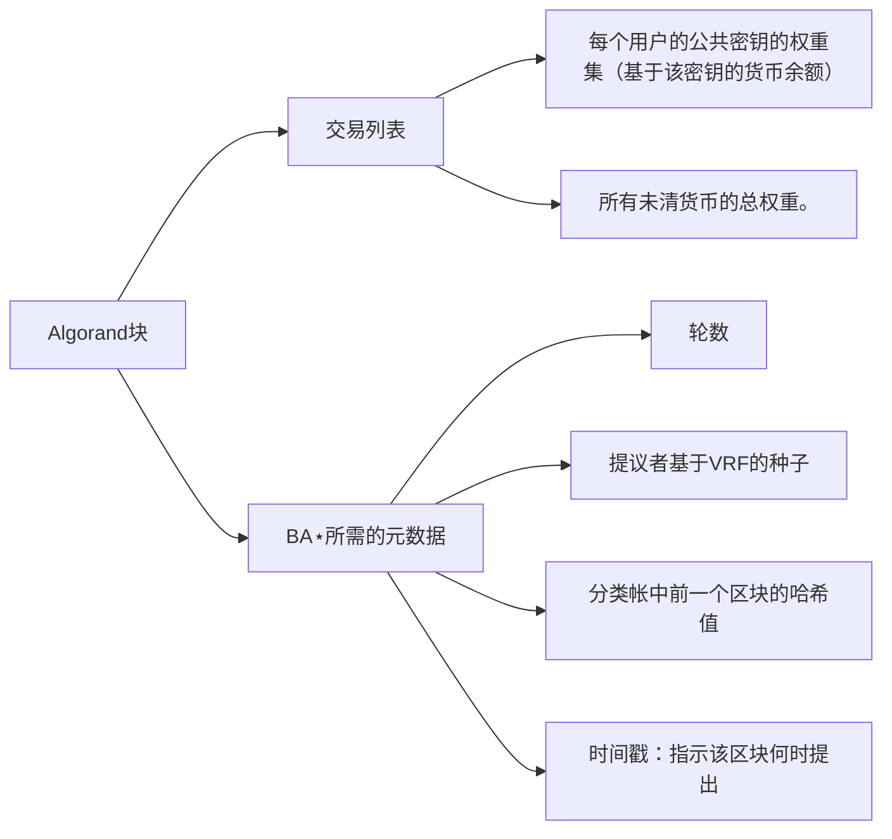

# Algorand

基于可验证随机函数（Verifiable Random Functions) 满足低延迟、不存在无分叉的在新区块上达成共识

## 三个挑战

1. 避免**Sybil攻击**（*Sybil attacks*，即敌手通过创建许多假名影响拜占庭协议）
2. BA⋆的用户必须拓展达**百万**级
3. 抵抗**拒绝服务攻击**（*denial-of-service attacks*，即让目标机器停止提供服务），同时保证即使攻击者断开一些用户连接仍可以继续运作。

## 使用技术

1. **加权用户**

   - 为防止Sybil攻击，根据用户账户中的资金对用户进行权衡，**分配权重**

   - BA⋆旨在保证共识，只要用户的加权分数（大于 2/3 的常数）是诚实的即可

   - 避免分叉与双花

2. **通过委员会**（*committee*）**达成共识**

   - 根据用户权重随机选取委员会成员，确保足够比例委员会成员诚实

   - 委员会运行协议的每一个步骤，实现可扩展性

   - 其他用户观察允许他们了解商定块的协议消息

   不足：委员会成员可能会面临针对性攻击

3. **加密抽签**（*Cryptographic sortition*）

   - 通过计算私钥与区块链公共信息的（VRF）函数，以**私人、非交互**的方式选取委员会成员

   - 选择用户后，函数将返回一个短字符串向其他用户说明选取用户的委员会成员身份

   不足：委员会成员在开始参与BA⋆发送消息后将可以被敌手获取到

4. **参与者更换**

   BA⋆要求委员会成员**只发言一次**，实现手段为：

   - 避免使用除用户私钥外任何的私有状态，使所有用户参与能力相同；
   - 拜占庭协议每一步骤中选取新的委员会成员

## 加密假设

1. 诚实用户运行无错误的软件

2. 诚实用户所持有部分的钱高于某一阈值h（大于2/3的常数）

3. 敌手可破坏目标用户、不可破坏持有大量金钱的用户

4. “强同步”假设（*"strong synchrony"assumption*）

   实现活跃性目标

   允许敌手控制一些诚实用户的网络，但不允许敌手大规模操纵网络，并且不允许网络分区

5. “弱同步”假设（*“weak synchrony” assumption*）

   实现安全性目标

   网络可长时间内强烈异步，但在异步周期后的很长一段时间内必须强烈同步

6. 所有用户的时钟松散同步（ *loosely synchronized clocks across all users*）

## 加密抽签

> Cryptographic sortition is an algorithm for choosing a random subset of users according to per-user weights

给定所有用户权重

### Selection procedure

检查是否选择了用户参加委员会

参数：

- ***τ***  determines the expected numberof users selected for that role.

- ***j*** indicates how many times the user was chosen and  means that the user gets to participate as *j* different “sub-users.”
- ***W*** is the total amount of currency units in Algorand
- ***p*** is the probability the user is selected.
- ***sk*** is the user’s secret key

#### 抽签的两个重要属性

1. 给定一个随机种子，VRF输出基本均匀分布在0和2^(hashlen)-1之间的伪随机散列值。 
2. 敌手无法获知用户是否被选取和用户被选取的次数。
3. an adversary that does not know*sk i* cannot guess how many times user*i* is chosen, or if *i* was chosen at all

   

### Choosing the seed

The seed published at Algorand’s round *r* is determined using VRFs with the seed of the previous round *r* −1.
$$
⟨seed_r,π⟩ ← VRF_{sk_u} (seed_r−1 ||r)
$$

$$
seed_r = H(seed_{r−1} ||r)
$$

### **Choosing** *sk_u* **well in advance of the seed**

## 块提案

> To ensure that some block is proposed in each round, Algorand sets the sortition threshold for the block-proposal role, *τ*_proposer, to be greater than 1

- **最小化不必要的块传输（Minimizing unnecessary block transmissions）**

  - 为了减少此成本，使用分类哈希对块提议进行优先级排序，通过对与子用户索引连接的 VRF的（可验证的随机）哈希输出进行哈希处理，获得提案的优先级。

  - Algorand 用户会丢弃有关该块的优先级最高的消息

- **等待块提案 （Waiting for block proposals）**

  Algorand estimates these quantities (*λ*_stepvar, the variance in how long it takes different users to finish the last step of *BA*⋆, and *λ*_priority, the time taken to gossip the priority and proof message), and waits for *λ*_stepvar +*λ*_priority time to identify the highest priority.

- **恶意提议者 （Malicious proposers）**

  - 如果对手不是一轮中最高优先级的提议者，那么最高优先级的提议者将向所有用户传播其区块的一致版本。
  - 如果对手是回合中最高优先级的提议者，则他们可以提议空白区域，从而防止任何实际交易被确认。

## BA⋆

> key：*BA*⋆ keeps no secrets,except for user private keys. This allows any user observing the messages to “passively participate” in the protocol: verify signatures, count votes, and reach the agreement decision.

### main procedure

算法确定建立最终共识（final consensus）还是临时共识（tentative consensus）

参数：

- *ctx*：分类账（ledger）当前状态
- *round* 
- *block*：来自最高优先级提议者的最新提议
- *H*：加密哈希函数

### Voting

#### Sending votes

伪代码检查在给定的 BA⋆步骤中是否选择了用户作为委员会成员

#### **Counting votes**

从入库消息缓冲区读取属于当前回合和步骤的消息。

- τ是排序()为委员会选择的预期用户数
- T是定义BA⋆投票阈值的预期委员会规模（T>2/3）的一小部分；
- *λ* 时间窗口，超过则返回TIMEOUT。

不仅返回消息中包含的值，还返回与该值关联的投票数。

#### Reduction

在任意值（块的散列）上达成共识的问题转换为在两个值之一上达成共识的问题：特定提议的块散列（specific proposed block hash）或空块的散列（empty block hash）。

#### **Binary agreement**

达成传递给BinaryBA⋆（）的哈希或空块的哈希上的共识

- 强同步性下的安全性
- 弱同步性下的安全性

计算所有用户共有的硬币。如果一个用户获得了多个投票（即，选择了几个子用户），则 CommonCoin（）通过用子用户索引对该用户的分类哈希进行哈希处理，来考虑该用户的多个哈希。

#### **Committee size** 委员会规模

 T（控制达成共识所需的票数）和τ（控制预期的委员会规模），T 尽可能地小，τ需要尽可能大

 *T_step*和*τ__step*的约束：
$$
\frac{1}{2}g+b ≤ T_{step} ·τ_{step}
$$

$$
g > T_{step} · τ_{step}
$$

*g*为诚实委员会成员的人数

*b*为恶意委员会成员的人数

## Algorand

### 引导程序

- 引导系统：向所有用户提供一个通用的创世块以及最初的密码分类种子
- 引导新用户：学习BA⋆共识结果链的结果，生成证书

### 通信成本

每个用户的通信成本取决于委员会的预期规模和提议者的数目。Algorand 通过 **τ**_proposer，**τ**_step

和 **τ**_final（与用户数目无关）设置该数目

## 评估

- Algorand 可以在一分钟内很好地确认交易，并且随着用户数量的增加，延迟几乎是恒定的。
- Algorand 的达成协议时间（即 BA⋆）与块大小无关，即使是大块也保持相同（12s）
- 随着 Algorand 块大小的增长，Algorand 以更高的延迟为代价实现了更高的吞吐量

## 未来研究点

1. 激励措施

2. 加盟费用（证书所包含的大量数据）

3. 转发安全性：攻击者可能会随着时间的流逝而破坏用户的身份

   解决方案：让用户在发送签名消息之前忘记签名密钥（并提前使用一系列签名密钥，也许使用基于身份的加密
